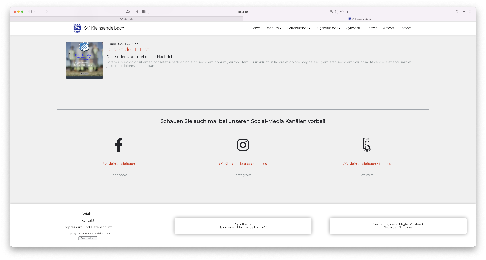
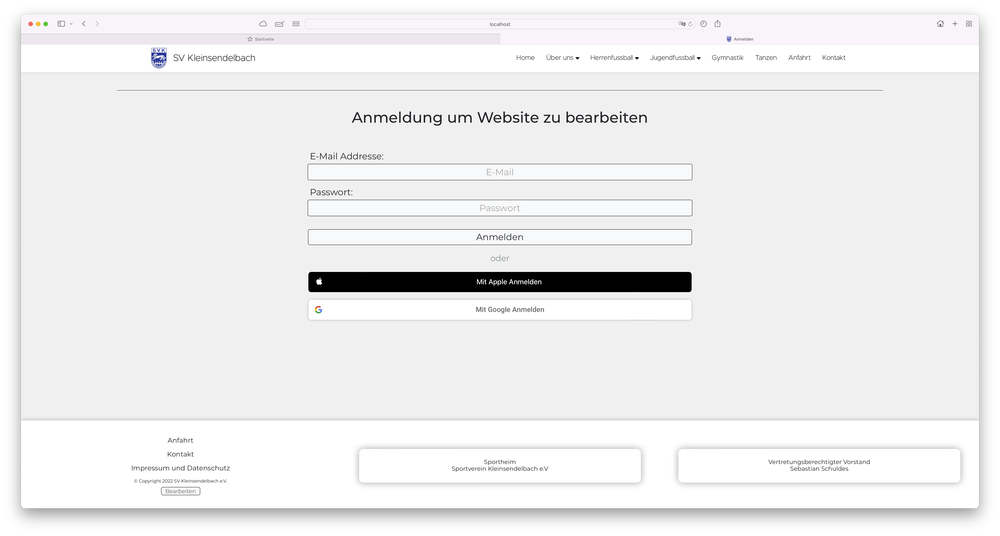
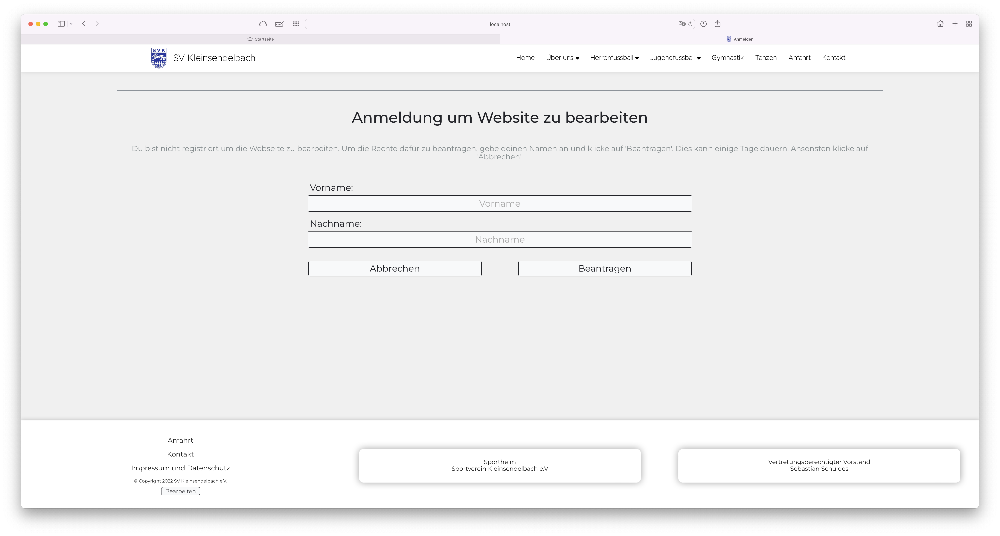
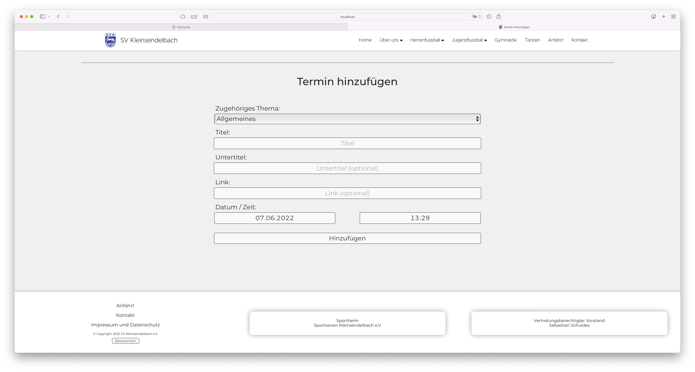
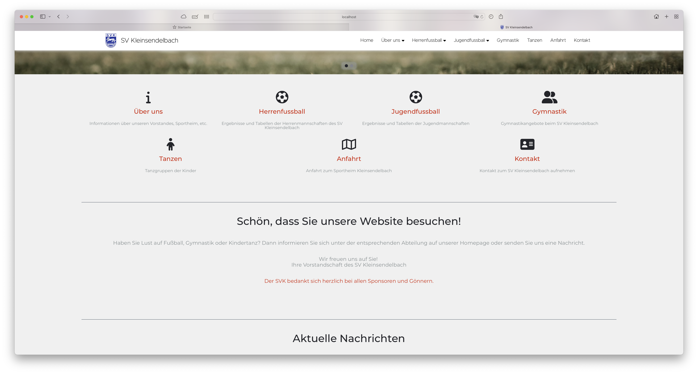
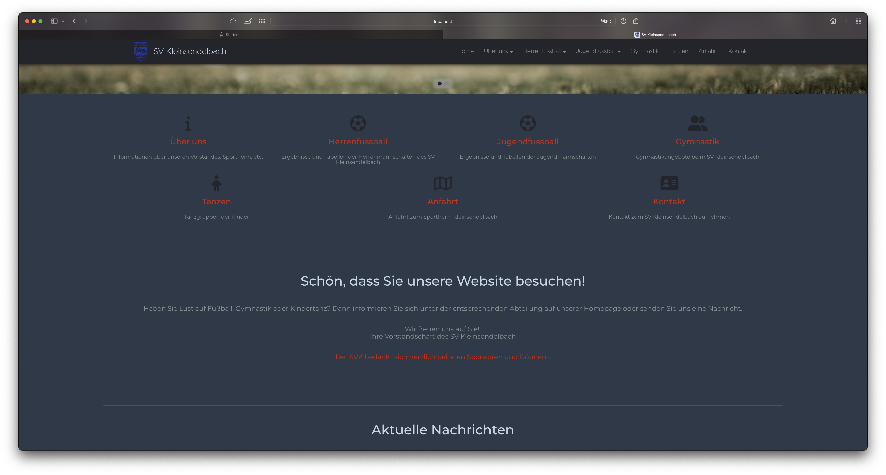
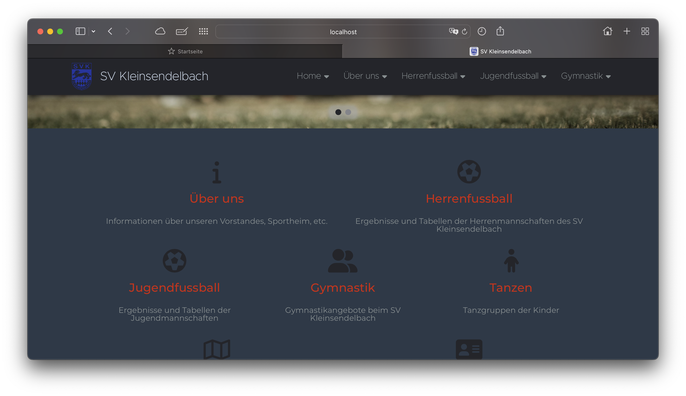
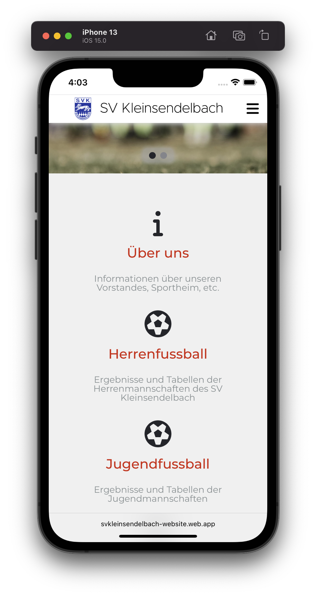
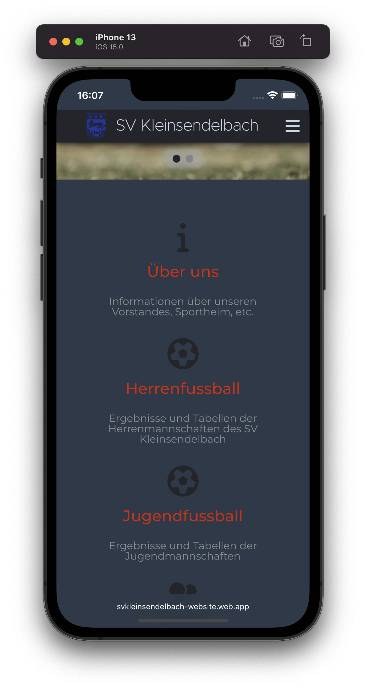

# Webseite des SV Kleinsendelbach e.V. 

Dieses Projekt wird genutzt, um die Webseite des `SV Kleinsendelbach e.V.` mit mehr als 20 einzelnen Seiten zu bauen. Die Webseite ist zurzeit für die Entwicklung auf [`https://svkleinsendelbach-website.web.app`](https://svkleinsendelbach-website.web.app) verfügbar.

## Inhaltverzeichnis
- [Website des SV Kleinsendelbach e.V.](#webseite-des-sv-kleinsendelbach-ev)
  - [Inhaltsverzeichnis](#inhaltverzeichnis)
  - [Fehlerbericht und Featureanfrage](#fehlerbericht-und-featureanfrage)
  - [Webseite bearbeiten](#webseite-bearbeiten)
  - [Dunkles Design und Responsives Design](#dunkles-design-und-responsives-design)
  - [Entwicklung](#entwicklung)
    - [Lokale Entwicklung](#lokale-entwicklung)
    - [Weiterentwicklung](#weiterentwicklung)
    - [Build](#build)

## Fehlerbericht und Featureanfrage
- Um einen Fehler der Webeite zu melden, erstelle einen neuen Issue in [Github Issues](https://github.com/stevenkellner/svkleinsendelbach-website/issues) und wähle `Bug report` aus.
- Um eine neue Feature anzuforden, kannst du ebenfalls einen neuen Issue in [Github Issues](https://github.com/stevenkellner/svkleinsendelbach-website/issues) erstellen und wähle `Feature request` aus.

## Webseite bearbeiten

  
  

  

1. Auf der Hauptseite ganz links unten auf `Bearbeiten` klicken.
2. Anmelden um zu überprüfen, ob du berechtigt bist die Webseite zu bearbeiten.
3. Wenn du noch nicht berechtigt bist die Webseite zu bearbeiten, wirst du zu einer Seite weitergeleitet, auf der du den Zugriff beantragen kannst. Gebe hierfür deinen Name ein und klicke auf `Beantragen`. Es kann dann einige Tage dauern, bis du die Webseite bearbeiten kannst.

  

4. Du kannst einen neuen Termin hinzufügen oder einen alten bearbeiten:
    -  Wähle eine Kategory für den Termin aus: `Allgemeines`, `Herrenfußball`, `1. Mannschaft`, `2. Mannschaft`, `Alte Herren`, `Jugendfußball`, `C-Jugend`, `E-Jugend`, `F-Jugend`, `G-Jugend`, `Gymnastik` oder `Tanzen`.
    - Gebe einen Titel und optional einen Untertitel und einen zugehörigen Link ein.
    - Wähle einen Datum und eine Zeit aus und klicke auf `Hinzufügen` bzw. `Speichern`.

  

5. Du kannst einen neuen Artikel hinzufügen oder einen alten bearbeiten:
    - Gebe einen Titel und optional einen Untertitel ein.
    - Wähle für die Vorschau ein Thumbnail aus und gebe optional eine Kurzbeschreibung ein.
    - Du kannst eine Nachricht deaktivieren, dann wird sie nirgendswo mehr auf der Webseite angezeigt.
    - Erstelle eine Nachricht und klicke auf `Hinzufügen` bzw. `Speichern`.

## Dunkles Design und Responsives Design

Die Webseite unterstützt Designs für den Desktop, das Tablet und das Smartphone und für alles auch ein dunkles Design.

  
  

  
  

  
  

## Entwicklung

Dieses Projekt ist mit der [Angular CLI](https://github.com/angular/angular-cli) erstellt. Um mit der Entwicklung zu beginnen, installiere alle Dependecies mit `npm install`.

#### Lokale Entwicklung

Führe `ng serve` für die lokale Entwicklung aus. Navigiere nach `http://localhost:4200/`. Die Webseite wird automatisch neu geladen, wenn eine Datei geändert wird.

#### Weiterentwicklung

Führe `ng generate component component-name` aus um neue Komponenten zu genererieren. Du kannst außerdem `ng generate directive|pipe|service|class|guard|interface|enum|module` benutzen.

#### Build

Führe `ng build` aus um das Projekt zu bauen. Die gebauten Artifacts sind danach in dem `dist/` Ordner verfügbar.
